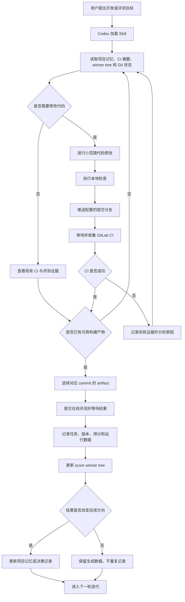

# CICIEC Stage 3 迭代 Skill

这是一个面向 Codex 的 CICIEC Stage 3 SoC 项目迭代 Skill。它将项目记忆、
GitLab CI、构建产物、在线评测、成绩记录和最优版本维护连接成一套可重复执行的
工作流，帮助不同 Codex 会话在已有证据基础上继续开发，而不是每次重新理解项目。

> 本 Skill 是 Codex 的项目操作规程和流程编排层，不是独立运行的常驻机器人。
> 仓库已包含 CI 收集、在线评测、CBOR Trace 分析、winner tree 更新、完整链路
> 包装器和工作区初始化模板；用户只需提供自己的项目代码、服务地址、项目 ID 和
> 访问凭据。

## 运行效果

下面是通过完整迭代流程获得的前端测评结果。任务 `5267` 对应版本
`1f9cb365`，测评状态为 `Finished`，得分为 `100.00`，并已标记为最终提交版本。


## Skill 的作用

普通开发会话结束后，关键状态往往散落在聊天记录、Git 提交、CI 页面和评测页面
中。下一个会话需要重新查找这些信息，容易重复尝试、遗漏最佳版本或误用旧数据。

本 Skill 主要解决以下问题：

| 问题 | Skill 提供的作用 |
| --- | --- |
| 新会话不了解项目现状 | 优先读取项目记忆、最新 CI 摘要和 winner tree |
| CI 结果只存在网页中 | 将 pipeline、job、commit 和 artifact 信息沉淀为本地数据 |
| 构建成功后需要手工提交评测 | 统一产物选择、在线提交、等待结果和成绩记录流程 |
| 多个版本难以判断最佳结果 | 根据评测数据生成并维护 score winner tree |
| 失败和低分实验被重复执行 | 保留历史证据，让后续决策建立在已有结果之上 |
| 推送、评测等操作风险较高 | 区分只读、干运行和真实提交命令，并设置分支与凭据边界 |

## 核心能力

- **项目上下文恢复**：读取项目记忆、CI 数据管线说明、当前 winner tree 和仓库状态。
- **CI 证据沉淀**：收集 GitLab pipeline、job、commit、状态和 artifact 信息。
- **在线评测自动化**：选择成功构建产物，提交在线评测并等待最终结果。
- **成绩持续记录**：将任务、版本、得分和运行结果追加到结构化数据中。
- **最优版本维护**：从历史成绩中生成 winner tree，识别当前最佳版本。
- **Trace 证据分析**：解析 CBOR 测评 Trace、UART 标记、程序指纹和时序区间。
- **完整迭代闭环**：串联代码修改、检查、推送、CI、评测和下一轮决策。
- **跨会话协作**：让新的 Codex 会话基于持久化证据继续工作。
- **操作安全约束**：保护凭据，避免误推主分支、覆盖用户修改或误触实时评测。

## 完整工作流程



### 各阶段说明

| 阶段 | Codex 的动作 | 主要产物 |
| --- | --- | --- |
| 1. 状态恢复 | 读取项目记忆、CI 摘要、winner tree、Git 状态 | 当前已知状态和最佳版本 |
| 2. 开发修改 | 根据目标进行小范围修改，保留用户已有改动 | 待验证的代码版本 |
| 3. 本地验证 | 执行与修改范围匹配的检查 | 本地检查结果 |
| 4. CI 构建 | 推送指定分支，等待 GitLab pipeline 和 job | CI 状态与构建 artifact |
| 5. 在线评测 | 选择正确 commit 的成功产物并提交 | 评测任务和最终得分 |
| 6. 数据沉淀 | 写入 CI、评测结果和 winner tree | JSONL、JSON、Markdown 摘要 |
| 7. 决策更新 | 只在结果改变后续方向时更新项目记忆 | 下一轮可复用的策略上下文 |

## 输入与输出

### 输入

Skill 运行时通常需要以下信息：

- 用户提出的开发、验证、CI 收集或在线评测目标
- 兼容的 CICIEC 项目工作区
- 提交仓库目录和允许推送的工作分支
- 项目记忆、CI 数据和已有评测记录
- 通过环境变量提供的 GitLab 与在线评测凭据

### 输出

配套工具链通常维护以下数据：

| 文件 | 内容 |
| --- | --- |
| `ci_data/ciciec_stage3_ci_runs.jsonl` | 历次 CI pipeline 和 job 的结构化记录 |
| `ci_data/ciciec_stage3_ci_latest.md` | 最新 CI 状态的人类可读摘要 |
| `ci_data/ciciec_stage3_eval_results.jsonl` | 历次在线评测任务与成绩记录 |
| `ci_data/ciciec_stage3_strategy_summaries.jsonl` | 各版本实现思路、优缺点和后续优化建议 |
| `ci_data/ciciec_stage3_score_winner_tree.json` | 机器可读的最优版本关系 |
| `ci_data/ciciec_stage3_score_winner_tree.md` | 当前最佳成绩和版本的可读展示 |
| 项目记忆或结果台账 | 对未来设计决策有持续价值的结论 |

## 适用场景

以下请求适合触发 `$ciciec-stage3-iteration`：

- “先读取项目沉淀，告诉我当前最佳版本和下一步建议。”
- “收集最近的 GitLab CI 结果，但不要推送或提交在线评测。”
- “检查当前提交是否已有成功产物，先做一次评测 dry-run。”
- “把当前版本走完 push、CI、在线评测和成绩记录全链路。”
- “刷新评测结果和 winner tree，判断是否出现新的最佳版本。”
- “接手上一轮 Codex 的工作，基于现有证据继续优化。”

## 安装

```sh
git clone https://github.com/Niyu24-Hub/ciciec-stage3-iteration-skill.git
cp -R ciciec-stage3-iteration-skill/ciciec-stage3-iteration \
  "${CODEX_HOME:-$HOME/.codex}/skills/"
```

安装后，在 Codex 中通过 `$ciciec-stage3-iteration` 显式调用。符合 Skill 描述的
CICIEC Stage 3 请求也可以触发自动加载。

### 初始化项目工作区

公开仓库已经内置完整配套工具和非敏感模板。将它们安装到目标工作区：

```sh
export CICIEC_WORKSPACE=/path/to/ciciec_workspace
bash "${CODEX_HOME:-$HOME/.codex}/skills/ciciec-stage3-iteration/scripts/bootstrap_workspace.sh" \
  "$CICIEC_WORKSPACE"
```

初始化脚本会：

- 安装 6 个 CI、评测、Trace 分析和成绩维护工具到 `$CICIEC_WORKSPACE/tools/`
- 创建项目记忆、CI 管线说明和结果台账模板
- 创建 `ci_data/` 目录、空 JSONL 数据文件和初始 winner tree
- 生成不含真实凭据的 Bash `ciciec.env.example` 和 PowerShell
  `ciciec.env.example.ps1`
- 默认保留工作区中已经存在的同名文件

只有明确需要覆盖已有工具或模板时才使用 `--force`。

## 环境配置

### Linux / WSL（Bash）

设置兼容的项目工作区、提交仓库目录和工作分支：

```sh
export CICIEC_WORKSPACE=/path/to/ciciec_workspace
export CICIEC_SUBMISSION_REPO=regional-submission
export CICIEC_SUBMISSION_REF=submit/codex
```

配置用户自己的 GitLab、在线评测服务和项目标识：

```sh
export CICIEC_GITLAB_API_URL=https://gitlab.example.com/api/v4
export CICIEC_GITLAB_PROJECT_ID=123
export CICIEC_JUDGE_BASE_URL=https://judge.example.com
export CICIEC_STAGE3_LAB_ID='optional-if-auto-discovery-works'
```

执行 CI 收集和在线评测时，通过当前 Shell 设置凭据：

```sh
export GITLAB_TOKEN='...'
export CICIEC_JUDGE_USER='...'
export CICIEC_JUDGE_PASSWORD='...'
```

上述变量只在当前终端会话中有效。建议通过受保护的 Shell 配置或秘密管理工具保存
非公开值，不要把真实 Token 和密码写入仓库中的配置文件。

### Windows（PowerShell）

在 PowerShell 中使用 `$env:` 设置当前终端会话的环境变量：

```powershell
$env:CICIEC_WORKSPACE = "C:\path\to\ciciec_workspace"
$env:CICIEC_SUBMISSION_REPO = "C:\path\to\regional-submission"
$env:CICIEC_SUBMISSION_REF = "submit/codex"
$env:CICIEC_CI_REF = $env:CICIEC_SUBMISSION_REF

$env:CICIEC_GITLAB_API_URL = "https://gitlab.example.com/api/v4"
$env:CICIEC_GITLAB_PROJECT_ID = "123"
$env:CICIEC_JUDGE_BASE_URL = "https://judge.example.com"
$env:CICIEC_STAGE3_LAB_ID = "optional-if-auto-discovery-works"

$env:GITLAB_TOKEN = "replace-in-current-shell"
$env:CICIEC_JUDGE_USER = "replace-in-current-shell"
$env:CICIEC_JUDGE_PASSWORD = "replace-in-current-shell"
```

Windows 原生环境可以使用 `python` 或 Python Launcher 的 `py -3` 运行 Python
工具；Shell 包装器和 `bootstrap_workspace.sh` 需要在 WSL 或 Git Bash 中运行。
PowerShell 环境变量同样只对当前终端有效，请勿使用会把真实密码写入仓库的脚本。

初始化脚本会从 Skill 中安装以下配套工具：

- `tools/ciciec_iterate.sh`
- `tools/ciciec_ci_push_collect.sh`
- `tools/collect_ciciec_ci.py`
- `tools/ciciec_judge.py`
- `tools/update_ciciec_eval_winners.py`
- `tools/check_stage3_trace.py`

## CBOR Trace 分析

分析指定 Trace 文件，或自动选择目录中最新的 `.cbor` 文件：

```sh
python3 tools/check_stage3_trace.py /path/to/trace-or-directory
```

使用本次提交生成的 `user-sample.bin` 校验 Trace 中的程序身份：

```sh
python3 tools/check_stage3_trace.py \
  --expected-bin /path/to/user-sample.bin \
  /path/to/trace-or-directory
```

该工具完全在本地只读运行，不依赖第三方 Python 模块。它会展示 UART 事件、
`MATMUL_START`/`MATMUL_DONE` 标记、CRC、时序区间、大型字节串、SHA-256 程序指纹
和最终 Trace 证据判定。

## 命令与风险级别

| 命令 | 作用 | 风险级别 |
| --- | --- | --- |
| `tools/ciciec_iterate.sh status` | 查看本地数据、CI 和评测状态 | 只读 |
| `python3 tools/ciciec_judge.py list-submissions --limit 10` | 查询近期评测任务 | 只读 |
| `tools/ciciec_iterate.sh collect-ci` | 拉取并更新本地 CI 证据 | 远端只读、本地写入 |
| `python3 tools/ciciec_judge.py submit --latest-success --dry-run --no-record` | 验证产物选择，不实际提交 | 干运行 |
| `python3 tools/check_stage3_trace.py <trace>` | 本地解析 CBOR Trace 和程序指纹 | 本地只读 |
| `tools/ciciec_iterate.sh judge-current` | 提交当前 commit 的 CI 产物 | 实时评测 |
| `tools/ciciec_iterate.sh full-chain` | 推送分支、等待 CI、提交评测并记录成绩 | 完整实时操作 |

建议先执行 `status`，再执行 dry-run，确认仓库、分支、commit 和 artifact 对应关系后，
才运行 `judge-current` 或 `full-chain`。

## 在 Codex 中使用

### 只查看状态

```text
使用 $ciciec-stage3-iteration 读取项目记忆、最新 CI 和 winner tree，
只报告当前状态，不推送代码，也不提交在线评测。
```

### 收集 CI 证据

```text
使用 $ciciec-stage3-iteration 收集最近 30 条 GitLab CI 记录，
刷新本地摘要并说明当前最新成功构建对应的 commit。
```

### 在线评测前检查

```text
使用 $ciciec-stage3-iteration 检查当前提交的仓库状态和 CI artifact，
先执行 dry-run，确认不会选错版本。
```

### 执行完整迭代

```text
使用 $ciciec-stage3-iteration 完成当前版本的本地检查、分支推送、
GitLab CI 等待、在线评测和 winner tree 更新，并汇报最终结果。
```

## 安全边界

- 仅通过环境变量传递 Token、用户名和密码。
- 不把访问令牌、密码、Cookie 或命令历史写入项目文件。
- 默认不修改 `.gitlab-ci.yml`，除非用户明确要求。
- 不推送 `main` 或 `master`，只使用配置的提交分支。
- 不回退或覆盖用户已有修改；仓库不干净时先理解变更来源。
- 运行实时命令前确认目标仓库、分支、commit 和 artifact。
- 只有新结果影响未来设计方向时，才更新人工维护的项目记忆或结果台账。

## 公开版本边界

本仓库现在包含完整的 Skill 定义、初始化工具、6 个项目工具脚本、数据模板和中文
说明。出于安全及版权边界，以下用户私有内容不会随仓库发布：

- 个人文件系统路径和私有仓库标识
- GitLab Token、在线评测账号和密码
- 比赛提交源代码、私有 GitLab 配置及 CI 构建产物
- 自动生成的 CI、评测和 winner tree 数据文件
- 真实 GitLab/在线评测服务地址、项目 ID、实验 ID 及其他私有配置

因此，克隆仓库后已经可以完成 Skill 安装和工作区工具初始化；要连接真实 CI 和
在线评测服务，用户仍需提供自己的项目仓库、服务配置和合法访问权限。

## 仓库结构

```text
.
├── README.md
├── LICENSE
├── docs/images/
│   └── frontend-evaluation.png
└── ciciec-stage3-iteration/
    ├── SKILL.md
    ├── agents/
    │   └── openai.yaml
    ├── scripts/
    │   ├── bootstrap_workspace.sh
    │   └── project-tools/
    │       ├── check_stage3_trace.py
    │       ├── ciciec_iterate.sh
    │       ├── ciciec_ci_push_collect.sh
    │       ├── collect_ciciec_ci.py
    │       ├── ciciec_judge.py
    │       └── update_ciciec_eval_winners.py
    ├── references/
    │   └── workflow.md
    └── templates/
        ├── ciciec.env.example
        ├── ciciec.env.example.ps1
        ├── CICIEC_STAGE3_PROJECT_MEMORY.md
        ├── CICIEC_STAGE3_CI_DATA_PIPELINE.md
        ├── CICIEC_STAGE3_CI_RESULTS.md
        └── ci_data/
            ├── ciciec_stage3_ci_latest.md
            ├── ciciec_stage3_score_winner_tree.json
            └── ciciec_stage3_score_winner_tree.md
```

- `SKILL.md`：Skill 的触发描述、核心工作方式和安全规则。
- `agents/openai.yaml`：Codex 界面展示名称、简介和默认调用提示。
- `scripts/bootstrap_workspace.sh`：将内置工具和模板安全安装到目标工作区。
- `scripts/project-tools/`：CI 收集、在线评测、Trace 分析、完整链路和 winner tree 工具。
- `references/workflow.md`：CI、评测、数据沉淀与完整链路的详细命令。
- `templates/`：不含真实凭据的 Bash/PowerShell 环境变量、项目记忆和数据初始化模板。
- `docs/images/frontend-evaluation.png`：公开 README 使用的效果截图。

## 许可证

本项目使用 [MIT License](LICENSE)。
